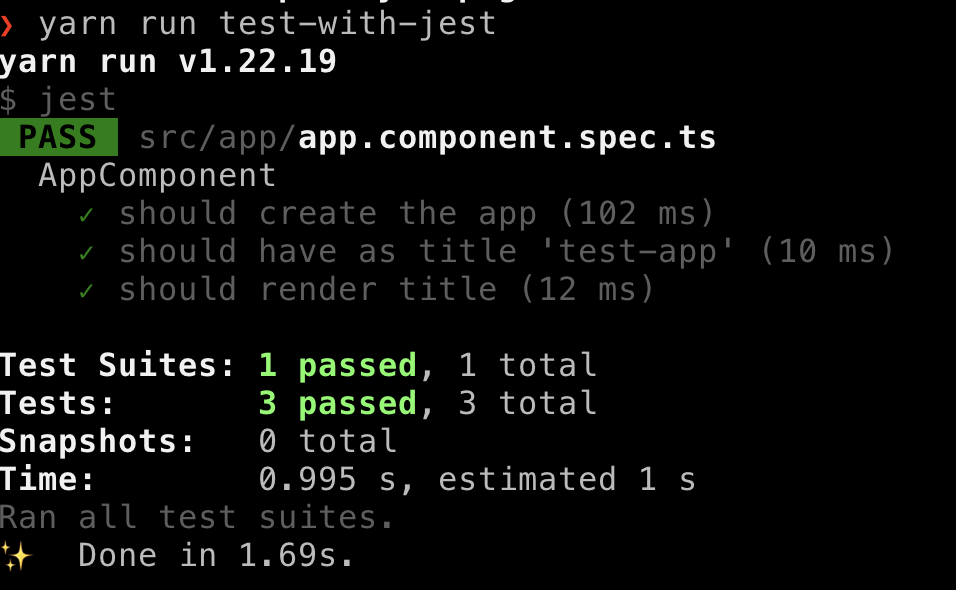

Example how angular can be tested with swc+jest instead karma+webpack

```sh
cd test-app
npm install
npm run test # run tests via karma 
npm run test-with-jest # run tests via jest 
```

or press `play` in your IDE of choice on an `it` function in the `spec` file, as jest can run spec isolated.



Note: The jest example doesn't use zone.js as I don't use zone.js. If you need that, look at
https://github.com/thymikee/jest-preset-angular how to get zone support into jest. 
